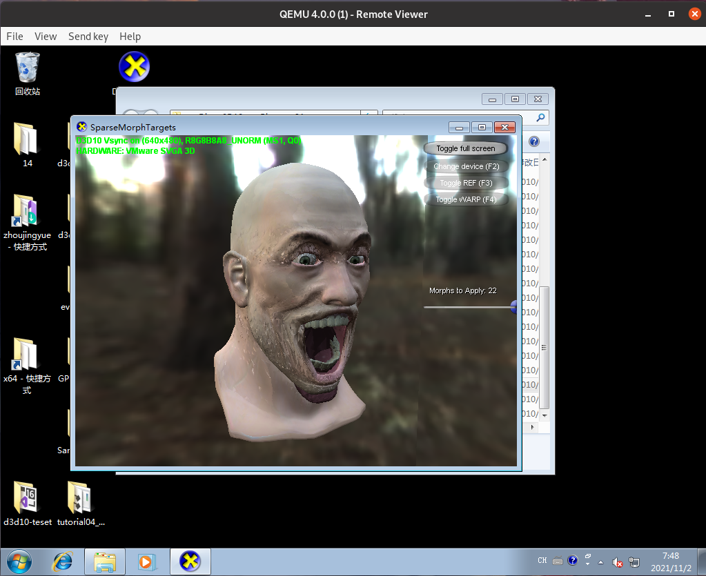
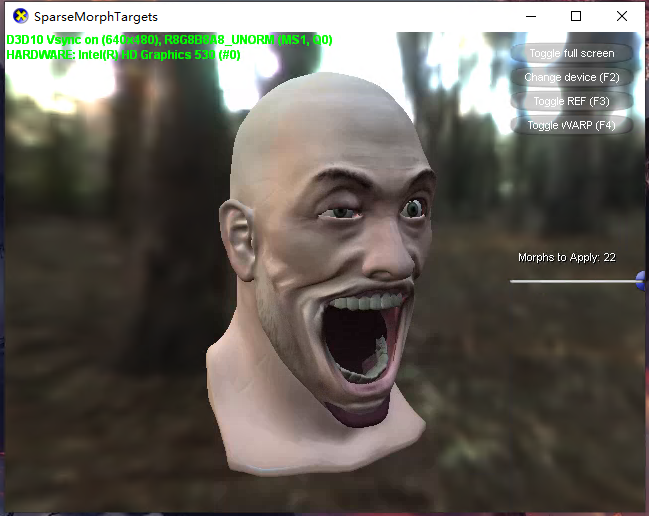
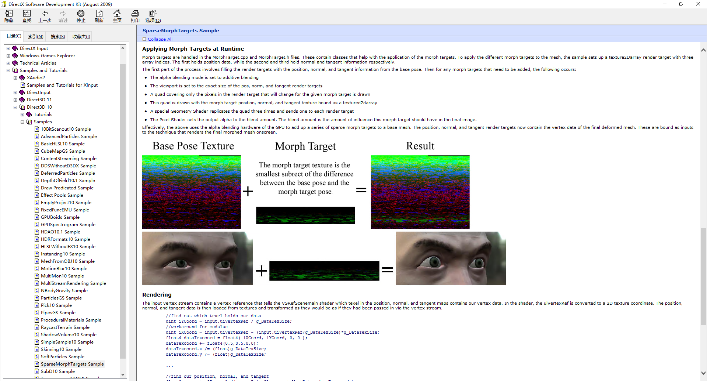
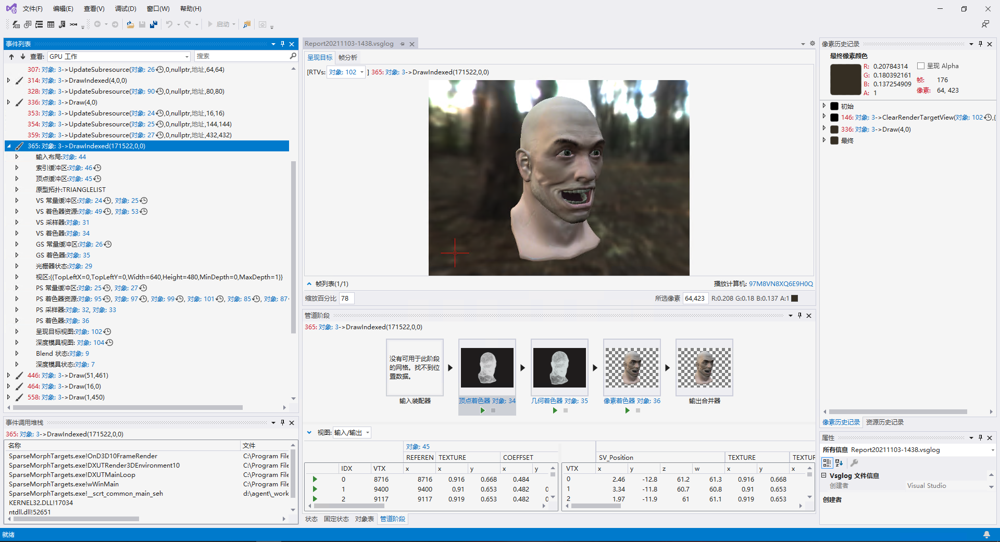
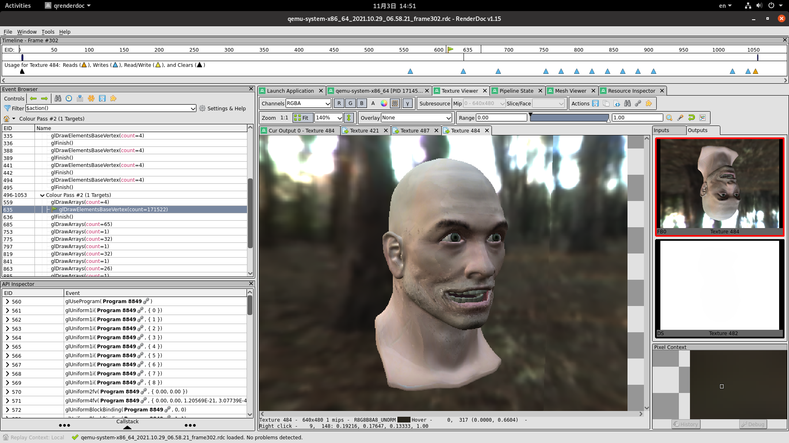
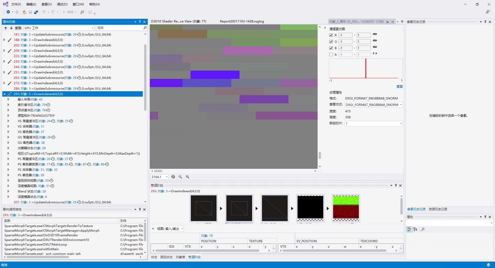
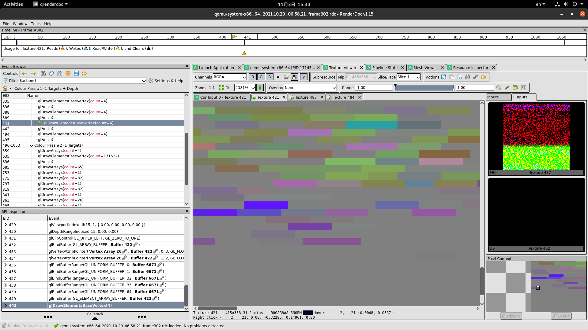
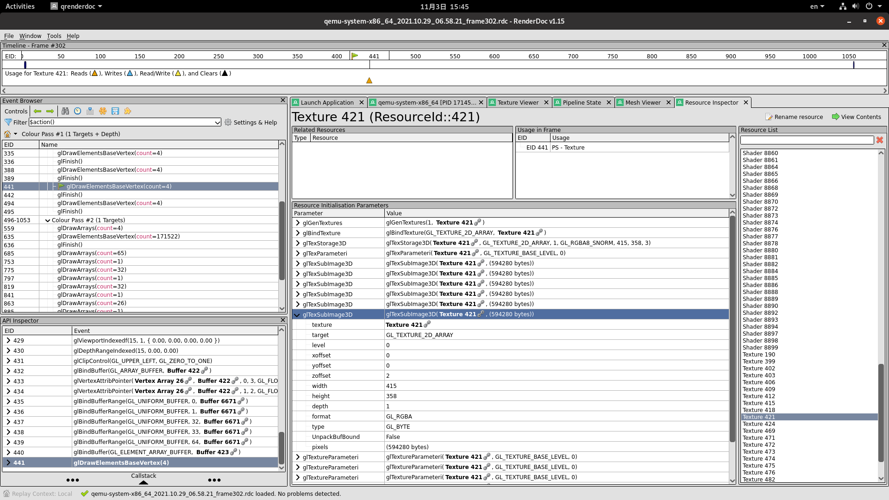
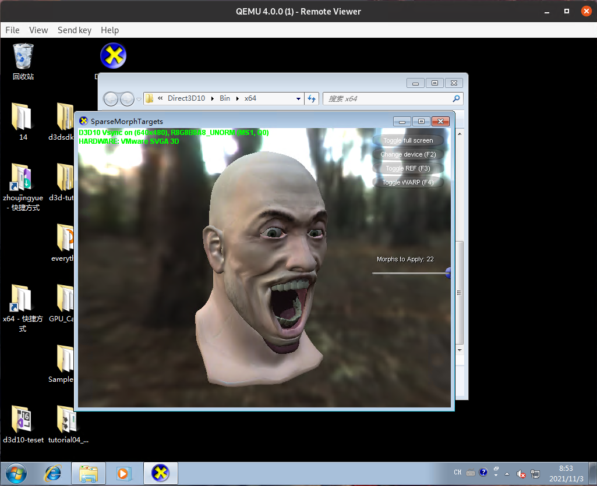

# VGPU执行3D渲染结果出错类问题排查方法

&emsp;&emsp;这个页面记录了对于VGPU执行3D渲染结果出错这类问题的排查方法，并以SparseMorphTargets皮肤碎裂问题排查过程作为样例说明。

## 1. 问题描述

&emsp;&emsp;VGPU执行3D渲染结果出错类问题通常的表现形式为：在运行某一个3D样例程序时，在物理机中运行得到的画面与在使用了VGPU的虚拟机中得到的画面不一致。这类问题是由于QEMU端VGPU代码不完善导致的，通常容易导致出错的原因包括：  

&emsp;&emsp;**一、数据传输出错**  
&emsp;&emsp;出错的数据类型可以包括纹理，顶点数据等。这些数据通过共享内存在VGPU驱动与VGPU设备间传递。并通过glTexSubImage2D，glNamedBufferData等OpenGL调用设置到GL环境中去。在这两个传输环节中都有可能出错。  

&emsp;&emsp;**二、OpenGL状态设置出错**   
&emsp;&emsp;OpenGL状态指的是为实现相关功能（例如深度测试，像素混合）而需要设置的状态变量（例如GL_DEPTH_TEST、GL_BLEND）。这些变量通常通过与功能相关的特定SVGA3D命令由VGPU驱动将相关设置发送到VGPU设备中。然后由VGPU设备通过相关GL调用进行设置（例如```glEnable(GL_DEPTH_TEST)```，```glDisable(GL_BLEND)```）。在这两个环节中都有可能出错。  

&emsp;&emsp;**三、Shader翻译出错**  
&emsp;&emsp;D3D程序使用的HLSL shader先在VGPU驱动中被翻译为SM4（[**Shader Model 4**](https://docs.microsoft.com/en-us/windows/win32/direct3dhlsl/dx-graphics-hlsl-sm4-asm) 着色器汇编代码）传输至VGPU设备中。VGPU设备再将其翻译成GLSL shader，然后调用glShaderSource，将shader传输至OpenGL环境中。错误大多出现在将SM4翻译成GLSL的过程中。  

&emsp;&emsp;SparseMorphTargets皮肤碎裂问题在使用VGPU作为虚拟显卡的QEMU虚拟机进入Windows7操作系统，运行[**DirectX SDK**](https://www.microsoft.com/en-us/download/details.aspx?id=6812)中的 Direct3D10样例程序SparseMorphTargets时出现。问题表现为：画面中人物眼角处，嘴唇处皮肤有撕裂的现象。  



&emsp;&emsp;该样例程序在正常运行时效果为：



&emsp;&emsp;你可以打开[**正常运行视频**](./video1.mp4)观看正常运行效果。  

## 2. 排查过程

&emsp;&emsp;排查过程可以大致分为三步：

&emsp;&emsp;**一、了解出问题的测试用例，了解新增的3D使用方法**  
&emsp;&emsp;该步骤包括阅读程序源代码，阅读测试用例说明文档，将出问题的测试用例与运行正常的测试用例作比较等方法。VGPU已经通过了一部分的测试用例，未通过的测试用例往往都使用了一些此前测试未覆盖的3D使用方法，这些使用方法往往和错误有紧密联系。分析出问题程序中的新增的3D使用方法，有助于后续调试过程中快速定位问题原因。

&emsp;&emsp;**二、比对D3D指令与VGPU翻译出的OpenGL指令，定位到OpenGL调用**  
&emsp;&emsp;首先分别在物理机调试环境与VGPU调试环境中各截取一帧运行该测试用例时出问题的画面。然后从后向前，比对绘制该帧画面时的每一个子绘制过程的输出纹理，由此将错误定位到某一个子绘制过程。再分析比对该子绘制过程渲染管线各阶段的输入输出以及变量状态，由此将错误定位到一个确定的OpenGL调用上。可以作为参考的是，往往这个OpenGL调用实现了前述测试用例中新增的3D使用方法。

&emsp;&emsp;**三、在VGPU源代码中找到这个OpenGL调用位置，分析出错原因**  
&emsp;&emsp;每一个OpenGL调用都是由VGPU在接收到某个SVGA3D命令后调用的。该步骤可以从调试VGPU调用该OpenGL指令的位置开始，找到该OpenGL指令需要使用的变量，再找到设置这些变量的代码位置，最后找到出错原因。

### 2.1 了解出问题的测试用例，了解新增的3D使用方法

&emsp;&emsp;从文档中可以看到，该测试用例的实现原理为：  
&emsp;&emsp;一、收集人脸基准表情与带各种情绪表情的模型顶点坐标、法线以及切线。  
&emsp;&emsp;二、将各个情绪表情的模型顶点坐标、法线以及切线与基准表情做差，得到描述各个表情的模型顶点坐标、法线以及切线差值。  
&emsp;&emsp;三、将代表各个表情的差值，乘以一定系数，叠加到基准表情上。得到最终要绘制的模型顶点坐标、法线以及切线差值。  
&emsp;&emsp;四、绘制最终得到的模型。  



&emsp;&emsp;等问题排查完毕后进行分析，发现导致该测试用例出问题的新增3D使用方法为：将模型顶点坐标、法线以及切线分别存放在了一个Texture的三个face上，并且这些数据都是从文件中读取的，而非计算得到。但实际操作中如果光靠分析测试用例，很难定位到这个新增3D使用方法，还需后续分析。  

### 2.2 比对D3D指令与VGPU翻译出的OpenGL指令，定位到OpenGL调用

&emsp;&emsp;使用[**Visual Studio 图形诊断工具**](https://docs.microsoft.com/zh-cn/visualstudio/debugger/graphics/visual-studio-graphics-diagnostics?view=vs-2019)捕获在物理机上运行SparseMorphTargets的一帧运行画面，选择绘制人像画面的命令```ID3D10Device->DrawIndexed(171522,0,0)```，可以看到绘制出的人像，以及该绘制操作的输入输出信息。  



&emsp;&emsp;使用[**RenderDoc**](https://renderdoc.org/)运行使用VGPU的QEMU虚拟机，并在虚拟机内运行SparseMorphTargets，捕获一帧画面，选择绘制人像画面的命令```glDrawElementsBaseVertex(171522)```，同样可以看到绘制出的人像，以及该绘制操作的输入输出信息。对比就可发现，在这一个绘制操作时，就已经出现错误。  



&emsp;&emsp;```glDrawElementsBaseVertex(171522)```的输入数据为最终要绘制的模型顶点坐标、法线以及切线。这些数据是在之前的```glDrawElementsBaseVertex(4)```过程中通过将各个表情的模型顶点坐标、法线以及切线差值叠加到基准表情上得到的。将Visual Studio 图形诊断工具中的```ID3D10Device->DrawIndexed(4,0,0)```和RenderDoc中的```glDrawElementsBaseVertex(4)```进行比对，可以发现在输入纹理的第二个面，即输入的各个表情的模型顶点法线差值上，两边的每一行都有两个像素的偏移。  





&emsp;&emsp;通过查找操作该输入纹理的OpenGL调用，可以最终定位到往该纹理中拷贝数据的```glTexSubImage3D(Texture 421, (594280 bytes))```调用上。  



### 2.3 在VGPU源代码中找到这个OpenGL调用位置，分析出错原因

&emsp;&emsp;在QEMU代码中搜索glTexSubImage3D，可以发现glTexSubImage3D所使用的数据来源为```pImageSizeInfo->pImageGmrAddr```，而这段数据为此前从共享内存中拷贝得到。

``` c
        glTexSubImage3D(
            target,
            GLSurfaceInfo->mipLevel,
            xoffseta,
            yoffseta,
            zoffseta,
            widtha,
            heighta,
            deptha,
            GLSurface->FormatInfo_R8.pixel_format,
            GLSurface->FormatInfo_R8.pixel_type,
            (const void*)pImageSizeInfo->pImageGmrAddr);
```

&emsp;&emsp;通过打印```pImageSizeInfo->pImageGmrAddr```中的数据并与D3D中的原始数据比较可以发现，```pImageSizeInfo->pImageGmrAddr```中的数据多了8个字节的偏移，导致每行都向右移了两个像素的长度。考虑到这段数据是一个Texture的第二个面，怀疑是在计算第一个面的长度时存在8个字节的错误，导致拷贝第二个面时数据起点计算出错。找到计算每个面长度的函数并跟踪其调用过程，最终在其上层调用中找到不合理代码。  

``` c
    if (bTotalSizeAlign)
    {
        result = AlignmentMask & (TotalSize + AlignmentSize);
    }
    result = TotalSize;
    return result;
```

&emsp;&emsp;此处先在条件判断中对result赋值，之后又对result赋值，存在明显逻辑错误。且在调试中可以看到，result的值为594288，TotalSize的值为594280，正好相差8。综合分析代码上下文后得出结论：```result = TotalSize;```应该放在```if (bTotalSizeAlign)```之前。更改后再次编译，测试程序运行正常。  



