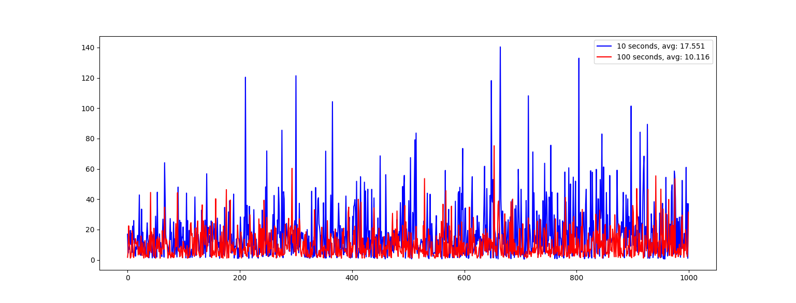

# Why People Thinking

&emsp;&emsp;见ppt：  

[information_world_algorithm-zhoujingyue.pptx](./information_world_algorithm-zhoujingyue.pptx)  

&emsp;&emsp;以下是实验数据：  

  

&emsp;&emsp;ppt一共分为了三部分。  
&emsp;&emsp;一、现有机器学习技术回顾，以及可能相关的技术。  
&emsp;&emsp;二、信息世界算法。在这里，我们设计游戏以训练模型。  
&emsp;&emsp;三、前向传播算法。提出了一种强化学习算法，尚未发现优秀的应用场景。  